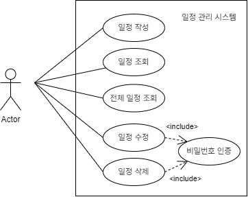

# SpringPersonal-1
입문 주차 - 일정 관리 시스템
 
 

# Usecase Diagram

 
 

# API 명세서

## 일정 작성
  
**Method**
- POST

**URL**
- /api/schedule

**Request**

{
"title" : "제목",
"contents" : "내용",
"owner" : "담당자",
"password" : "비밀번호"
}

**Response**

{ 
‘title’ : ‘제목’, 
‘contents’ : ‘내용’, 
‘owner’ : ‘담당자’,
’createdAt’ : 생성 날짜,
’modifiedAt’ : 수정 날짜
}

 
 

## 일정 조회
### 선택한 일정 조회
  
**Method**
- GET

**URL**
- /api/schedule/{scheduleId}

**Request**

**Response**
- 선택한 일정 정보

### 전체 일정 조회

**Method**
- GET

**URL**
- /api/schedules

**Request**

**Response**
- 모든 일정 정보

**기타**
- 작성일 기준으로 내림차순 정렬

 
 

## 일정 수정

**Method**
- PUT

**URL**
- /api/schedule/{scheduleId}

**Request**

{
"title" : "수정 제목",
"contents" : "수정 내용",
"owner" : "수정 담당자",
"password" : "비밀번호"
}

**Response**

{
"id": 아이디,
"title": "수정 제목",
"contents": "수정 내용",
"owner": "수정 담당자",
"createdAt": 생성 날짜,
"modifiedAt": 수정 날짜
}

**기타**
- 해당 일정에 저장된 비밀번호와 request body로 전달된 비밀번호가 일치해야 일정 수정 가능

 
 

## 일정 삭제 

**Method**
- DELETE

**URL**
- /api/schedule

**Request**

{
"id" : 아이디,
"password" : "비밀번호"
}

**Response**
- 삭제 성공 여부

**기타**
- 해당 일정에 저장된 비밀번호와 request body로 전달된 비밀번호가 일치해야 일정 삭제 가능

